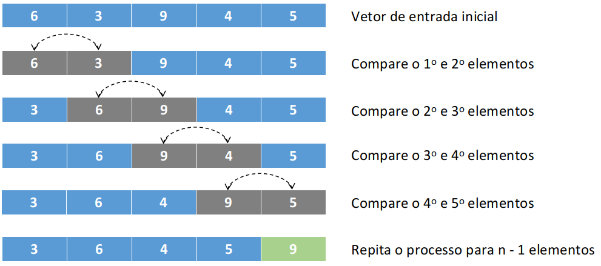

# Bubble Sort: Implementação em C

 
 
 
 

 

 

Método de ordenação simples de custo computacional quadrático que utiliza sucessívas comparações para a realização de ordenação. O bubble sort ou método da bolha é um método de ordenação por flutuação cujo nome vem de uma analogia do comportamento de flutuação de bolhas de sabão, em que bolhas mais leves flutuam mais alto e logo definem uma certa ordenação a partir da comparação entre pesos.

Em sua implementação, o vetor dado como entrada é percorrido inúmeras vezes e a cada passadagem é inserido (i.e., flutuado) para o fundo/fim do vetor o elemento de maior valor. Considerando sua forma de execução, pode-se observar que sua complexidade computacional o inviabiliza para grandes entradas. Em literatura, há certa divergência quanto ao tamanho máximo/ideal de entrada para sua aplicação, sendo essa definida entre 25 a 50 elementos. 

Considerando um pequento exemplo com um vetor de 5 posições, vejamos como seria uma única interação do método para a ordenação de valores inteiros. 

	 

Observe pela figura acima que a cada interação do algoritmo, apenas um elemento é colocado em ordem, o que exige muito trabalho durante o processo de composição da ordenação correta. Nesse processo, a cada interação o vetor é revisitado para os n - 1 elementos restantes, o que faz com que o método seja executado até que se tenha 2 elementos ainda não vizitados. 

# Compilação e Execução

A lista dinâmica disponibilizada possui um arquivo Makefile que realiza todo o procedimento de compilação e execução. Para tanto, temos as seguintes diretrizes de execução:

| Comando                |  Função                                                                                           |                     
| -----------------------| ------------------------------------------------------------------------------------------------- |
|  `make clean`          | Apaga a última compilação realizada contida na pasta build                                        |
|  `make`                | Executa a compilação do programa utilizando o gcc, e o resultado vai para a pasta build           |
|  `make run`            | Executa o programa da pasta build após a realização da compilação                                 |

# Contatos

 

<a style="color:black" href="mailto:michel@cefetmg.br?subject=[GitHub]%20Source%20Dynamic%20Lists">
✉️ <i>michel@cefetmg.br</i>
</a>
